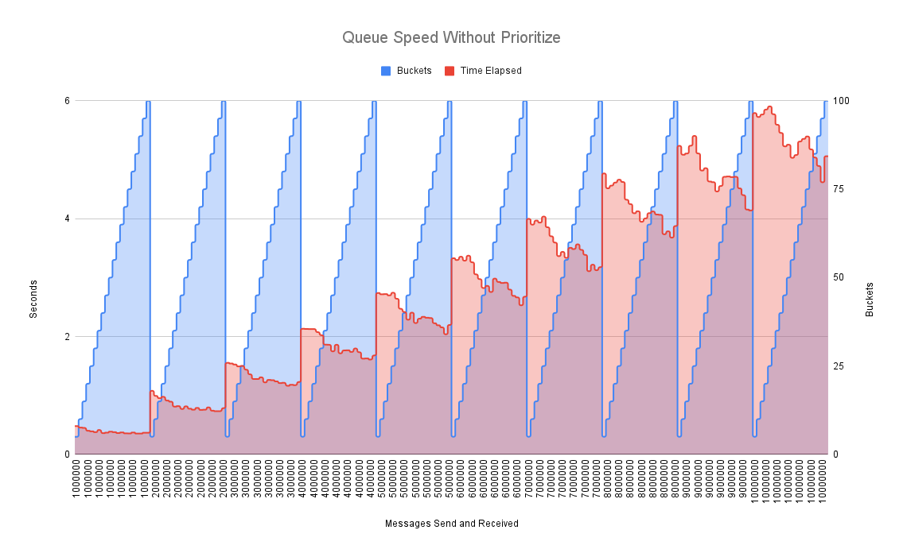
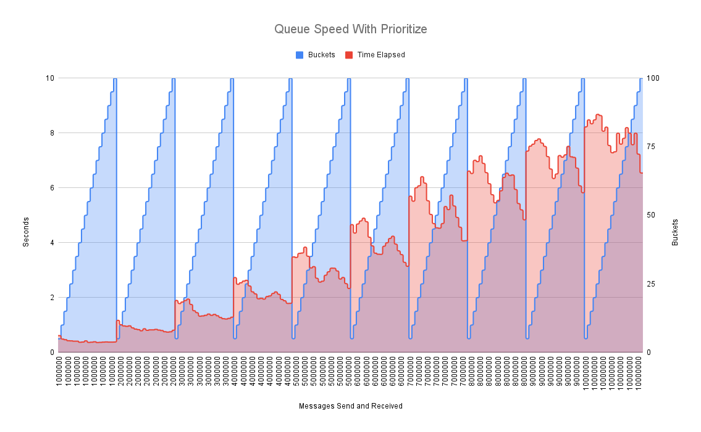
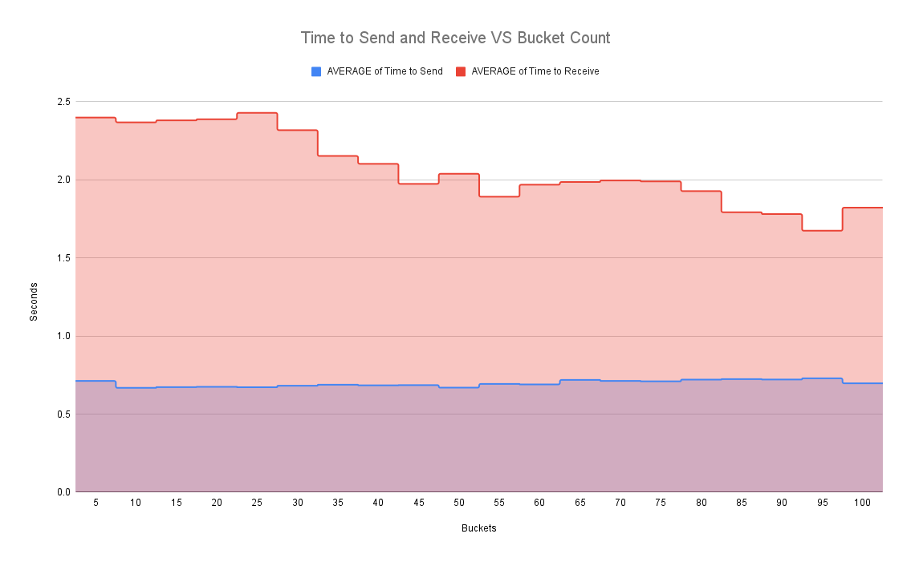

<p align="center">
  
</p>

<h4 align="center">
	GPQ is an extremely fast and flexible priority queue, capable of millions transactions a second. GPQ supports a complex "Double Priority Queue" which allows for priorities to be distributed across N buckets, with each bucket holding a second priority queue which allows for internal escalation and timeouts of items based on parameters the user can specify during submission combined with how frequently you ask GPQ to prioritize the queue.
</h4>

## Notice
While GPQ is largely stable, bugs are more than likely present at this early stage, and you should carefully consider if your application can tolerate any down time or lost messages that may result from adopting this project into a production workflow. If you run into any bugs please submit an issue or better a PR! Check out the guide to contributing below.


## Table of Contents
- [Notice](#notice)
- [Table of Contents](#table-of-contents)
- [Background](#background)
	- [Should I Use GPQ?](#should-i-use-gpq)
	- [Sister Projects](#sister-projects)
- [Benchmarks](#benchmarks)
- [Usage](#usage)
	- [Prerequisites](#prerequisites)
	- [API Reference](#api-reference)
	- [Submitting Items to the Queue](#submitting-items-to-the-queue)
- [Contributing](#contributing)
	- [We Develop with Github](#we-develop-with-github)
	- [All Code Changes Happen Through Pull Requests](#all-code-changes-happen-through-pull-requests)
	- [Any contributions you make will be under the MIT Software License](#any-contributions-you-make-will-be-under-the-mit-software-license)
	- [Report bugs using Github's Issues](#report-bugs-using-githubs-issues)
	- [Write bug reports with detail, background, and sample code](#write-bug-reports-with-detail-background-and-sample-code)
- [License](#license)

## Background
GPQ was written as an experiment when I was playing with [Fibonacci Heaps](https://en.wikipedia.org/wiki/Fibonacci_heap) and wanted to find something faster. I was disappointed by the state of research and libraries being used by most common applications, so GPQ is meant to be a highly flexible framework that can support a multitude of workloads.

### Should I Use GPQ?
GPQ is a concurrency safe, embeddable priority queue that can be used in a variety of applications. GPQ might be the right choice if:
- Your data requires strict ordering guarantees
- You need to prioritize items that are in the queue too long 
- You need to timeout items
- You have multiple writers and readers that need to access the queue concurrently
- You run critical workloads and need to store the queue on disk in case of a crash

### Sister Projects
- [fibheap (Fibonacci Heaps)](https://github.com/JustinTimperio/fibheap)
- [rpq (Rust Priority Queue)](https://github.com/JustinTimperio/rpq)
- [gpq-server (GPQ Server)](https://github.com/JustinTimperio/gpq-server)
- [pq-bench (Priority Queue Benchmarks)](https://github.com/JustinTimperio/pq-bench)


## Benchmarks
Due to the fact that most operations are done in constant time `O(1)` or logarithmic time `O(log n)`, with the exception of the prioritize function which happens in linear time `O(n)`, all GPQ operations are extremely fast. A single GPQ can handle a few million transactions a second and can be tuned depending on your work load. I have included some basic benchmarks using C++, Rust, Zig, Python, and Go to measure GPQ's performance against the standard implementations of other languages that can be found here at: [pq-bench](https://github.com/JustinTimperio/pq-bench) 

|                                                                                                             |                                                                                                          |
|-------------------------------------------------------------------------------------------------------------|----------------------------------------------------------------------------------------------------------|
|  |                            |
|                                     |  |

## Usage
GPQ at the core is a embeddable priority queue meant to be used at the core of critical workloads that require complex queueing and delivery order guarantees. The best way to use it is just to import it.

```go
import "github.com/JustinTimperio/gpq"
```

### Prerequisites 
For this you will need Go >= `1.22` and gpq itself uses [hashmap](https://github.com/cornelk/hashmap) and [BadgerDB](https://github.com/dgraph-io/badger). 

### API Reference
- `NewGPQ[d any](options schema.GPQOptions) (uint, *GPQ[d], error)` - Creates a new GPQ with the specified options and returns the number of restored items, the GPQ, and an error if one occurred. 
  - `ItemsInQueue() uint` - Returns the number of items in the queue.
  - `ItemsInDB() uint` - Returns the number of items in the database.
  - `ActiveBuckets() uint` - Returns the number of active buckets.
  - `Enqueue(item schema.Item[d]) error` - Enqueues an item into the queue.
  - `EnqueueBatch(items []schema.Item[d]) error` - Enqueues a batch of items into the queue.
  - `Dequeue() (*schema.Item[d], error)` - Dequeues an item from the queue.
  - `DequeueBatch(batchSize uint) ([]*schema.Item[d], error)` - Dequeues a batch of items from the queue.
  - `Prioritize() error` - Prioritizes the queue based on the values in each item.
  - `Close()` - Closes the queue and saves the queue to disk.

### Submitting Items to the Queue
Once you have an initialized queue you can easily submit items like the following:
```go
package main

import (
  "log"
  "time"

  "github.com/JustinTimperio/gpq"
)

func main() {
	defaultMessageOptions := schema.EnqueueOptions{
		ShouldEscalate: true,
		EscalationRate: time.Duration(time.Second),
		CanTimeout:     true,
		Timeout:        time.Duration(time.Second * 1),
	}

	opts := schema.GPQOptions{
		MaxPriority: maxBuckets,

		DiskCacheEnabled:      true,
		DiskCachePath:         "/tmp/gpq",
		DiskCacheCompression:  true,
		DiskEncryptionEnabled: true,
		DiskEncryptionKey:     []byte("12345678901234567890123456789012"),
		DiskWriteDelay:       time.Duration(time.Second * 5),

		LazyDiskCacheEnabled: true,
		LazyDiskCacheChannelSize:  1_000_000,
		LazyDiskBatchSize:    10_000,
	}

	_, queue, err := gpq.NewGPQ[uint](opts)
	if err != nil {
		log.Fatalln(err)
	}

	for i := uint(0); i < total; i++ {
		p := i % maxBuckets
		item := schema.NewItem(p, i, defaultMessageOptions)

		err := queue.Enqueue(item)
		if err != nil {
			log.Fatalln(err)
		}
	}

	for i := uint(0); i < total; i++ {
		item, err := queue.Dequeue()
		if err != nil {
			log.Fatalln(err)
		}
	}

	queue.Close()
}
```

You have a few options when you submit a job such as if the item should escalate over time if not sent, or inversely can timeout if it has been enqueued to long to be relevant anymore.

## Contributing
GPQ is actively looking for maintainers so feel free to help out when:

- Reporting a bug
- Discussing the current state of the code
- Submitting a fix
- Proposing new features

### We Develop with Github
We use github to host code, to track issues and feature requests, as well as accept pull requests.

### All Code Changes Happen Through Pull Requests
1. Fork the repo and create your branch from `master`.
2. If you've added code that should be tested, add tests.
3. If you've changed APIs, update the documentation.
4. Ensure the test suite passes.
5. Make sure your code lints.
6. Issue that pull request!

### Any contributions you make will be under the MIT Software License
In short, when you submit code changes, your submissions are understood to be under the same [MIT License](http://choosealicense.com/licenses/mit/) that covers the project. Feel free to contact the maintainers if that's a concern.

### Report bugs using Github's [Issues](https://github.com/JustinTimperio/gpq/issues)
We use GitHub issues to track public bugs. Report a bug by opening a new issue; it's that easy!

### Write bug reports with detail, background, and sample code
**Great Bug Reports** tend to have:

- A quick summary and/or background
- Steps to reproduce
  - Be specific!
  - Give sample code if you can.
- What you expected would happen
- What actually happens
- Notes (possibly including why you think this might be happening, or stuff you tried that didn't work)

## License
All code here was originally written by me, Justin Timperio, under an MIT license with the exception of some code directly forked under a BSD license from the Go maintainers.