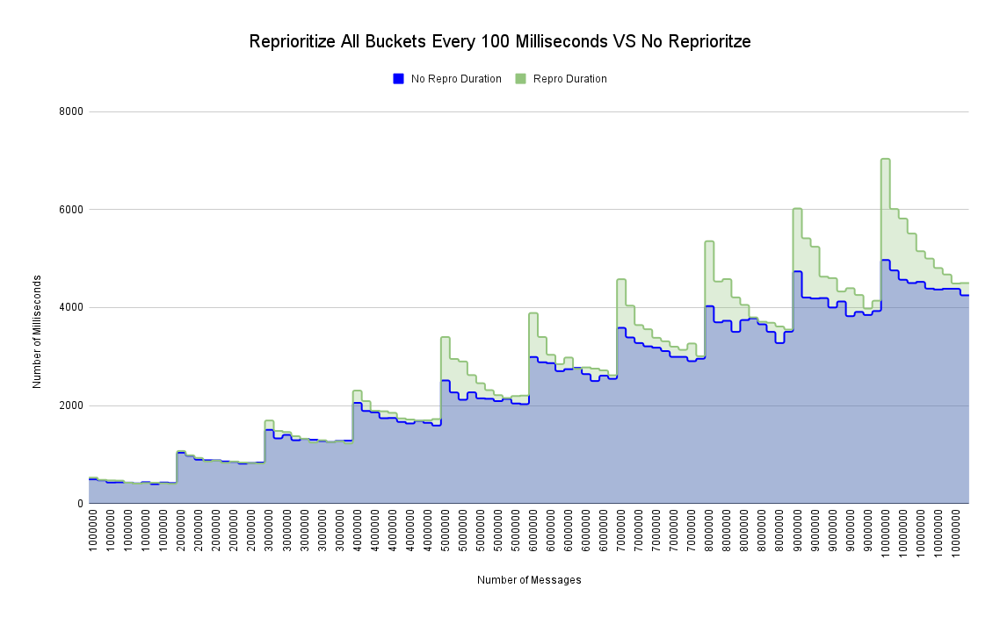
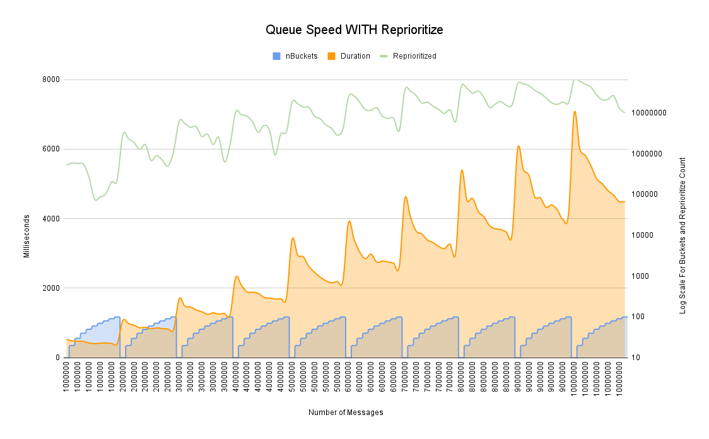
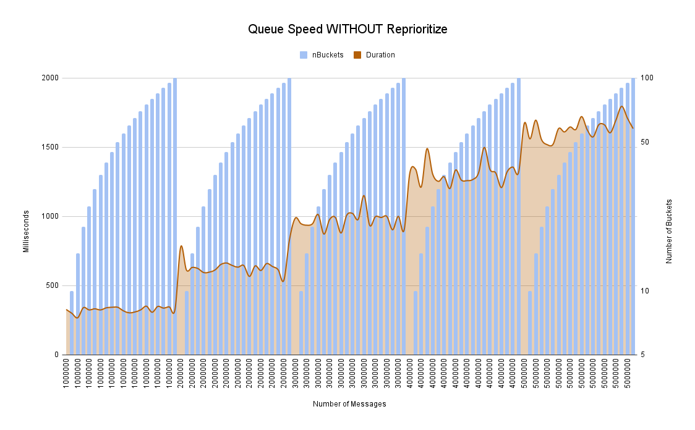

<p align="center">
  
</p>

<h4 align="center">
	GPQ is one of the worlds fastest and most flexible priority queues, supporting millions of transactions a second, even on laptops and low-end hardware. GPQ supports a complex "Double Priority Queue" which allows for priorities to be distributed across N buckets, with each bucket holding a second priority queue which allows for internal escalation of items based on a escalation rate the user can specify during submission combined with how frequently you ask GPQ to prioritize the queue. 
</h4>


## Table of Contents
1. [Table of Contents](https://github.com/JustinTimperio/gpq?tab=readme-ov-file#table-of-contents)
2. [Background](https://github.com/JustinTimperio/gpq?tab=readme-ov-file#background)
4. [Benchmarks](https://github.com/JustinTimperio/gpq?tab=readme-ov-file#benchmarks)
3. [Usage](https://github.com/JustinTimperio/gpq?tab=readme-ov-file#usage)
5. [Contributing](https://github.com/JustinTimperio/gpq?tab=readme-ov-file#contributing)
6. [License](https://github.com/JustinTimperio/gpq?tab=readme-ov-file#license)

## Background
GPQ was written as an experiment when I was playing with [Fibonacci Heaps](https://github.com/JustinTimperio/fibheap) and wanted to find something faster. I was disappointed by the state of research and libraries being used by most common applications, so GPQ is meant to be highly flexible framework that can support a multitude of workloads.

## Benchmarks
Due to the fact that most operations are done in constant time `O(1)`, with the exception of prioritize function which happens in linear time `O(n)`, all GPQ operations are extremely fast. A single GPQ can handle millions of transactions a second and can be tuned depending on your work load. I have included some basic benchmarks using C++, Rust, and Go to measure GPQ's performance against the standard implementations of other languages. **For 10 Million entries, fully enqueued and dequeued, it takes about 3 seconds with Rust, 4.3 seconds with Go/GPQ and about 8.5 seconds for C++**.


<p align="center">
  
  
  
</p>


## Usage

### Prerequisites 
For this you will need Go >= `1.22` but beyond that gpq uses no external dependencies.

### Import Directly
GPQ is primarily a embeddable priority queue meant to be used at the core of critical workloads that require complex queueing and delivery order guarantees. The best way to use it is just to import it.

```go
import "github.com/JustinTimperio/gpq"
```


### API Reference
1. `NewGPQ[d any](NumOfBuckets int) *GPQ[d]` - Creates a new GPQ with n number of buckets 
   1. `EnQueue(data d, priorityBucket int64, escalationRate time.Duration) error` - Adds a piece of data into the queue with a priority and escalation rate 
   2. `DeQueue() (priority int64, data d, err error)` - Retrieves the highest priority item in the queue along with its priority
   3. `Prioritize() (uint64, []error)` - Prioritize stops transactions on each bucket concurrently to shuffle the priorities internally within the bucket depending on the escalation rate given at time of EnQueue'ing


#### Example Usage
```go
package main

import (
	"fmt"
	"log"
	"math/rand"
	"net/http"
	_ "net/http/pprof"
	"sync"
	"sync/atomic"
	"time"

	"github.com/JustinTimperio/gpq"
)

type TestStruct struct {
	ID   int
	Name string
}

// Set the total number of items and if you want to print the results
var (
	total      int  = 20000000
	prioritize bool = false
	print      bool = false
	nBuckets   int  = 1000
	sent       uint64
	received   uint64
)

func main() {

	// Create a new GPQ with a h-heap width of 100 using the TestStruct as the data type
	queue := gpq.NewGPQ[TestStruct](nBuckets)
	var reprioritized uint64

	// Setup the pprof server if you want to profile
	go func() {
		log.Println(http.ListenAndServe("0.0.0.0:6060", nil))
	}()

	// If you want to prioritize the queue, start the prioritize function
	// This will move items to the front of the queue if they have been waiting too long
	if prioritize {
		go func() {
			for {
				count, err := queue.Prioritize()
				time.Sleep(100 * time.Millisecond)

				if err != nil {
					log.Println("Prioritized:", count, "No items to prioritize in", len(err), "buckets")
					continue
				}
				log.Println("Prioritized:", count)
				atomic.AddUint64(&reprioritized, count)
			}
		}()
	}

	// Set up the wait group
	wg := &sync.WaitGroup{}
	timer := time.Now()

	// Launch 4 senders to simulate multiple incoming streams of data
	wg.Add(4)
	for i := 0; i < 4; i++ {
		go func() {
			defer wg.Done()
			sender(queue, total/4)
		}()
	}

	// Launch a receiver to simulate 2 consumers acting asynchronously
	wg.Add(2)
	for i := 0; i < 2; i++ {
		go func() {
			defer wg.Done()
			receiver(queue, total)
		}()
	}

	// Wait for all the senders and receivers to finish
	wg.Wait()

	// Print the results
	log.Println(
		"Sent:", sent,
		"Received:", received,
		"Finished in:", time.Since(timer),
		"Reprioritized:", reprioritized,
	)

}

func receiver(queue *gpq.GPQ[TestStruct], total int) {
	var lastPriority int64
	for total > int(received) {
		timer := time.Now()
		priority, item, err := queue.DeQueue()
		if err != nil {
			log.Println(err)
			time.Sleep(10 * time.Millisecond)
			continue
		}
		atomic.AddUint64(&received, 1)

		if print {
			log.Println("DeQueue", priority, item, time.Since(timer), "Total:", received)
		}
		if lastPriority > priority {
			log.Fatalln("Priority out of order")
		}
	}
}

func sender(queue *gpq.GPQ[TestStruct], total int) {
	for i := 0; i < total; i++ {
		r := rand.Int()
		p := rand.Intn(nBuckets)
		timer := time.Now()
		err := queue.EnQueue(TestStruct{
			ID:   r,
			Name: "Test-" + fmt.Sprintf("%d", r)},
			int64(p),
			time.Second,
		)
		if err != nil {
			log.Fatalln(err)
		}
		if print {
			log.Println("EnQueue", p, time.Since(timer), "Total:", sent)
		}
		atomic.AddUint64(&sent, 1)
	}
}
```


## Contributing
GPQ is actively looking for maintainers so feel free to help out when:

- Reporting a bug
- Discussing the current state of the code
- Submitting a fix
- Proposing new features

### We Develop with Github
We use github to host code, to track issues and feature requests, as well as accept pull requests.

### All Code Changes Happen Through Pull Requests
1. Fork the repo and create your branch from `master`.
2. If you've added code that should be tested, add tests.
3. If you've changed APIs, update the documentation.
4. Ensure the test suite passes.
5. Make sure your code lints.
6. Issue that pull request!

### Any contributions you make will be under the MIT Software License
In short, when you submit code changes, your submissions are understood to be under the same [MIT License](http://choosealicense.com/licenses/mit/) that covers the project. Feel free to contact the maintainers if that's a concern.

### Report bugs using Github's [Issues](https://github.com/JustinTimperio/gpq/issues)
We use GitHub issues to track public bugs. Report a bug by opening a new issue; it's that easy!

### Write bug reports with detail, background, and sample code
**Great Bug Reports** tend to have:

- A quick summary and/or background
- Steps to reproduce
  - Be specific!
  - Give sample code if you can.
- What you expected would happen
- What actually happens
- Notes (possibly including why you think this might be happening, or stuff you tried that didn't work)

### License
By contributing, you agree that your contributions will be licensed under its MIT License.

## License
All code here was originally written by me, Justin Timperio, under an MIT license with the exception of some code directly forked under a BSD license from the Go maintainers.